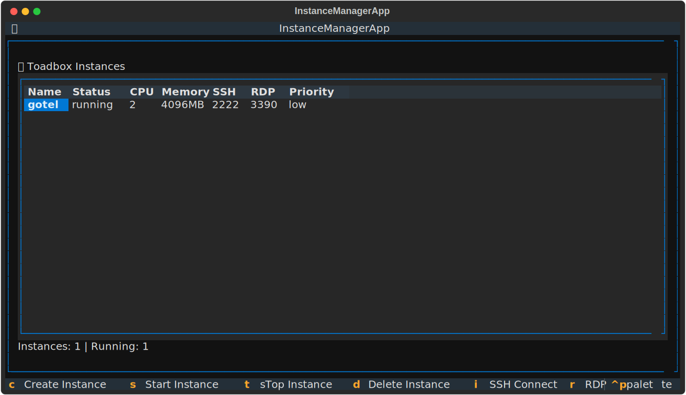

# Agentbox - Coding Agent Sandbox


There's no perfect way to sandbox agents (yet), but at least we can try limiting the damage using containers.

Agentbox is a simple Docker-based coding agent sandbox, originally inspired by running [Batrachian Toad](https://github.com/batrachianai/toad) as a general-purpose coding assistant TUI and now generalized to more tools.

Whatever agent you prefer, Agentbox aims to provide a reliable and isolated environment which will help you boostrap pretty much _any_ development environment.

## Motivation

I found myself wanting to quickly spin up isolated coding environments for AI agents, without having to deal with complex orchestration tools or heavy VMs, and also wanting to limit CPU usage from [Batrachian Toad](https://github.com/batrachianai/toad) itself.

## Features

The container provides a Debian userland, Homebrew, (optional) Docker-in-Docker, `ssh`/`mosh` server, and a minimal RDP desktop environment to run these:

- **[Batrachian Toad](https://github.com/batrachianai/toad)**: A unified interface for AI in your terminal
- **[Copilot CLI](https://github.com/github/copilot-cli)**: My usual go-to
- **[Mistral Vibe](https://github.com/mistralai/mistral-vibe)**: A nice coding assistant pre-installed
- **[OpenCode](https://github.com/anomalyco/opencode/)**: Another coding assistant pre-installed
- **Development Environment**: Debian Bookworm with essential development tools
- **Visual Studio Code**: for ARM or Intel
- **Package Managers**: Homebrew and APT package management, plus `uv`, `node`, `bun`, `go`, etc.
- **Docker-in-Docker**: Docker support for containerized workflows (requires you to run the container in privileged mode, so be careful)
- **Service Control**: Fine-grained control over which services start using environment variables (`ENABLE_DOCKER`, `ENABLE_SSH`, `ENABLE_RDP`)
- **Remote Access**: SSH (port 22) and RDP (port 3389) connectivity (disabled by default)
- **Minimal Desktop**: XFCE desktop with minimal utilities, so you can run graphical applications, Playwright, etc.
- **Persistent Storage**: optional data and agent home directory persistence

## Roadmap

- [x] CPU and memory limits (basic Docker resource constraints)
- [ ] Network isolation options
- [ ] Other sandboxing techniques (gVisor, Kata Containers, etc.)

## Service Configuration

Agentbox uses environment variables to control which services start at container launch:

- `ENABLE_DOCKER=true` - Start Docker daemon (for Docker-in-Docker support)
- `ENABLE_SSH=true` - Start SSH server (port 22)
- `ENABLE_RDP=true` - Start RDP server (port 3389)

**Default behavior:** All services are disabled unless explicitly enabled.

### Examples:

```bash
# Default - all services disabled
docker run -d agentbox

# Enable only Docker daemon
docker run -d -e ENABLE_DOCKER=true agentbox

# Enable Docker and SSH for development
docker run -d -e ENABLE_DOCKER=true -e ENABLE_SSH=true -p 22:22 agentbox

# Full desktop experience with all services
docker run -d -e ENABLE_DOCKER=true -e ENABLE_SSH=true -e ENABLE_RDP=true -p 22:22 -p 3389:3389 agentbox
```

## Quick Start

### Using Agentbox Manager (still WIP)



The Agentbox Manager is a first stab at a TUI for easily managing multiple agentbox instances with automatic naming, folder picker, and proper permission handling.

1. Clone or download this repository
2. Run the quick start script:

```bash
./run-manager.sh
```

**Manager Features:**

- 📁 **Folder Picker**: Browse and select workspace directories easily
- 🏷️ **Automatic Naming**: Container names and hostnames based on folder names
- 👤 **PUID/PGID Support**: Automatic permission alignment with host system
- 🐳 **Docker Compose**: Leverages docker-compose for orphan cleanup and resource management
- 🔄 **Multi-Instance**: Manage multiple development environments simultaneously

**Manager Usage:**

- Use arrow keys to navigate instances
- Press `c` to create a new instance
- Press `enter` to connect to selected instance
- Press `s` to start/stop instances
- Press `q` to quit

### Using Docker Compose (Manual)

If you prefer to use docker-compose directly:

1. Clone or download this repository
2. Create a `docker-compose.override.yml` file to enable services:

```yaml
version: "3.8"
services:
  agentbox:
    environment:
      - ENABLE_DOCKER=true
      - ENABLE_SSH=true
      - ENABLE_RDP=true
    ports:
      - "22:22"
      - "3389:3389"
```

3. Run the container:

```bash
docker-compose up -d
```

3. Connect to the container:

**Via RDP (Graphical Desktop):**

- RDP Client: `localhost:3389`
- Username: `agent`
- Password: `smith`

**Via SSH (Terminal):**

```bash
ssh agent@localhost -p 22
# Password: smith
```

### Using Docker Directly

```bash
# Build the image
docker build -t agentbox .

# Run the container with selected services
docker run -d \
  --name agentbox \
  --privileged \
  -e ENABLE_DOCKER=true \
  -e ENABLE_SSH=true \
  -e ENABLE_RDP=true \
  -p 22:22 \
  -p 3389:3389 \
  -v $(pwd):/workspace \
  agentbox
```

### Using Batrachian Toad

Once connected to the container:

1. Start Toad:

```bash
toad
```

2. Or start with a specific project directory:

```bash
toad /workspace
```

3. Or launch directly with an agent:

```bash
toad -a open-hands
```

## Security Notes

- **Service Control:** By default, all services (Docker, SSH, RDP) are disabled. Explicitly enable only what you need using environment variables.
- Default passwords are weak - change them for production use
- The container needs to run in privileged mode for Docker-in-Docker to be available to your agents (it's better than nothing)
- Consider using SSH keys instead of password authentication
- For production use, consider disabling unnecessary services and changing default credentials

For extra (in)security, consider running the manager with a remote Docker socket to a VM where the actual containers run.

## Credits

This project is loosely based on my ancient [rcarmo/docker-templates/desktop-chrome](https://github.com/rcarmo/docker-templates/tree/master/desktop-chrome) with an updated userland.

## License

MIT
